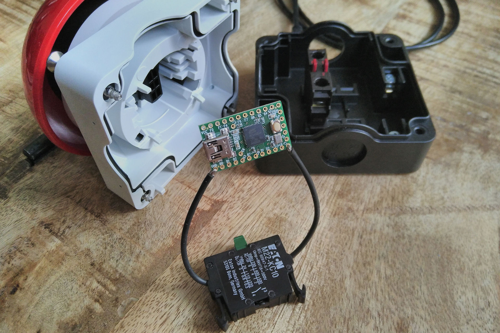
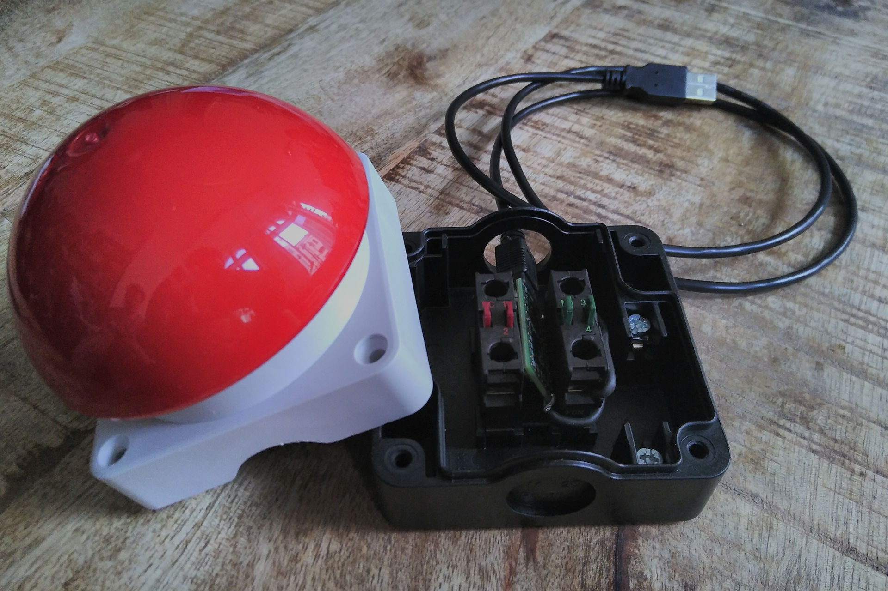

# 🔴 Building a big button

For [🔀 Keep or Sweep](http://keeporsweep.net) or whatever you can imagine. :)

Inspired by the [awesome button](https://makezine.com/projects/the-awesome-button/) and [The Button](http://rasterweb.net/raster/2011/05/09/the-button/).

## Supplies to order

- **[🔴 Eaton FAK-R/KC11/I big red button](https://ecat.eaton.com/catalog?deeplink=jkfk5)** (for ~37 € at [Voelkner](https://www.voelkner.de/products/144409/Eaton-FAK-R-KC11-I-Fuss-Grobhandtaster-230-V-AC-6A-1-x-Aus-Ein-IP67-tastend-1St..html), goes for ~70 € elsewhere)
- **[📻 Teensy 2.0 microcontroller](https://pjrc.com/store/teensy.html)**
- **🔌 Mini-USB to USB cable** (as Teensy 2.0 uses Mini-USB)
- **🐍 ~10 cm of wire** (to connect Teensy to switch)
- optional: [Rubber feet (like 3M SJ5012)](http://solutions.3m.com/wps/portal/3M/en_EU/Bumpon/Adhesive-Bumpers/Products/Catalogue/~/3M-Bumpon-Protective-Products-SJ5012-Black-3000-per-case?N=8697097%203294857473%204294920979&rt=d&MDR=true) (for better stability)
- optional: [Cable bushing (like 12mm EAN 2050000168062)](https://www.voelkner.de/products/39731/Kabeldurchfuehrung-Klemm-max.-12mm-PVC-Schwarz-1St..html) (for nicer look)
- optional: Two component glue (to fix the USB cable to the cable bushing)

I ordered everything at [Voelkner](https://www.voelkner.de/), but use whatever you prefer. I also got 2 of each to have separate buttons for [🔀 Keep or Sweep](http://keeporsweep.net).

## Tools you need

- **💻 Computer** to get the code onto the Teensy
- **🛠️ Screwdriver** to close the button casing
- optional: Soldering iron if you want to fix the connections properly

## Steps to build

1. Follow the [tutorial to install Arduino and Teensyduino](https://www.pjrc.com/teensy/tutorial.html) on your computer. In the process you will connect the Teensy to your computer.

2. Connect the switch in the button (I used the green one) to the Teensy using wires like this – one wire to GND, the other to C7:

(Optionally solder these connections. Based on wiring of [The Button / Another Button](http://rasterweb.net/raster/2011/06/27/another-button/).)

3. Get the code for Keep.ino (Space) or Sweep.ino (Delete), modify if needed, and transfer it to your Teensy with Arduino & Teensyduino. (Based on the code from [The Button](http://rasterweb.net/raster/2011/05/09/the-button/).)

4. Test if everything works, put the switch and Teensy in the casing, and screw the top half on:

5. Optional: Put on the rubber feet and the cable bushing for nicer finish.

And you should be done with your plug-and-play button! 🎉

